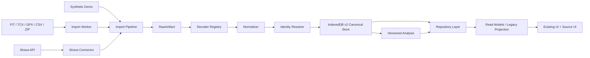

# StravaStats v2 架构总览

| 字段 | 内容 |
| --- | --- |
| Status | Proposed |
| Owner | XiChuan9 |
| Created | 2026-07-28 |
| Last updated | 2026-07-28 |
| Code baseline | `8b16ebe1a706f1713602ab5266e47000caf31a17` |

## 1. 背景

当前 StravaStats 是浏览器优先的 Vanilla JavaScript/PWA。应用通过 Vercel Serverless API 访问 Strava，活动摘要保存在 Legacy Cache 中，多个页面仍直接请求 Strava activity detail 和 streams。

V2 不重写现有 UI 和分析体系，而是在数据来源与消费者之间建立来源中立的数据层，使本地 FIT、TCX、GPX、Strava 归档、现有 Strava API 和 Demo 最终进入同一套 Repository、分析和可视化流程。

## 2. 架构目标

- Local-first：本地文件默认不上传服务器；
- Source-neutral：页面依赖 capabilities，不依赖 provider；
- Non-destructive：旧库、原始文件和用户修改不被覆盖；
- Idempotent：重复导入不产生重复活动；
- Versioned：解析、标准化和分析可以独立失效与重算；
- Progressive：先 Legacy，再 Shadow，最后 Canonical；
- Reversible：任何切换都有 Feature Flag 和数据回退路径。

## 3. 当前 V1 数据流

```text
Strava OAuth/API
→ Vercel Serverless Proxy
→ js/services/api.js 或页面直接 fetch
→ Legacy Cache / allActivities
→ preprocessActivities
→ Tabs / Activity Detail / Run Plus / NSM
```

当前主要问题：

- 页面和第三方 API 边界不完整；
- Strava DTO 充当事实上的领域模型；
- Legacy Cache 是缓存而不是长期资料库；
- 登出与本地数据生命周期耦合；
- Demo 通过页面特殊分支运行；
- 缺少测试、迁移和回滚证据。

## 4. 目标 V2 数据流



## 5. 运行模式

| 模式 | 写入路径 | 读取路径 | 目的 |
| --- | --- | --- | --- |
| `legacy` | Legacy Cache | Legacy Repository | 当前稳定与紧急回退 |
| `shadow` | Legacy + Canonical | Legacy Repository | 双写、Parity、无行为迁移 |
| `canonical` | Canonical Store | Canonical Repository | V2 正式模式 |

`shadow` 模式中 Canonical 失败不得影响 Legacy 页面。`canonical` 成为默认值后，Legacy 仍保留到正式稳定和回滚演练完成。

## 6. 组件边界

### Connector

负责认证、分页、同步、下载和来源状态。Connector 不负责页面渲染、Canonical 存储结构或分析算法。

### RawArtifact

保存原始文件或 API payload 的身份、hash、媒体类型和获取方式。原始内容不可变，用于审计、重新解析和备份。

### Decoder

只负责把某种格式转换为 `ImportedActivityBundle`。Decoder 不访问 UI、不写 IndexedDB、不生成 Chart.js 数据、不执行训练分析。

### Normalizer

负责字段、单位、时间、运动类型和 capabilities 统一。内部使用米、秒、瓦、bpm 和 UTC。

### Identity Resolver

P0 只自动处理明确身份：来源 external ID、SHA-256、FIT session identity 和已有 Source Reference。模糊匹配只生成人工审查候选。

### Canonical Store

以独立 IndexedDB `strava-stats-v2` 保存活动、streams、laps、events、来源、导入、分析、设置和 migration。不得原地升级或覆盖 `strava-dashboard-cache`。

### Repository

是页面、分析入口和数据实现之间的边界。页面不得直接读取 IndexedDB store 或调用第三方 API。

### Projection

迁移期把 Canonical 数据转换为当前页面期待的 Strava 风格字段，以避免同时重写全部 UI。Projection 是兼容层，不是永久 Canonical Schema。

### Analysis

只处理 Canonical Activity/Streams 或明确的 projection。分析结果按输入 hash、算法和设置版本缓存，版本失配时标记 stale。

## 7. 读写生命周期

### 导入写入

```text
validate
→ hash
→ decode
→ normalize
→ exact identity
→ transactional persist
→ analysis enqueue
→ import report
```

单个 ImportItem 失败不影响同批已成功项目；单活动相关写入必须事务化。

### 页面读取

```text
UI
→ Repository
→ Summary/Detail Query
→ Canonical or Legacy implementation
→ Projection
→ Existing renderer
```

应用启动只加载必要摘要；逐点 streams 在详情或分析明确需要时读取。

## 8. 存储边界

```text
Legacy:
  strava-dashboard-cache
  localStorage keys

V2:
  strava-stats-v2
  rawArtifacts
  importJobs/importItems
  activities/activitySources
  streamSeries/laps/events/devices
  userOverrides
  analysisSnapshots/timelineSnapshots
  mergeCandidates/mergeDecisions
  sourceConnections/settings/migrations
```

V2 不向 Legacy Cache 反向写入。删除任一数据库必须是显式、单独、可确认的用户操作。

## 9. 隐私边界

- 本地文件默认只在浏览器处理；
- Serverless API 仅保留 Strava Connector 必需能力；
- 日志和诊断包不记录 GPS、完整健康流、真实文件名和设备序列号；
- 外部 AI 或遥测需要用户单独授权；
- committed fixtures 只能是 synthetic 或经明确审查的匿名资料。

## 10. 渐进迁移

```text
Repo Safety
→ Legacy Rescue
→ Contracts / ADR
→ Legacy Repository
→ Consumer Boundary Migration
→ IndexedDB v2
→ Shadow Writer / Parity
→ Import Vertical Slice
→ File Decoders
→ Local-first Bootstrap
→ Consumer Cutover
→ Identity / Backup / Diagnostics
→ Default Canonical
```

迁移期间禁止把分析算法修订和数据来源切换合并在同一 PR。

## 11. 故障与回退

- Canonical 写入失败：记录错误，Legacy 页面继续；
- Canonical 读取异常：Feature Flag 切回 Legacy；
- migration 失败：事务回滚，migration 可重试；
- 导入文件损坏：单 Item 失败，不污染资料库；
- 发布失败：回退部署、更新 Service Worker cache 版本、revert Release PR；
- 恢复失败：不覆盖现有资料库。

详细步骤参见 [Rollback Plan](../migrations/rollback-plan.md)。

## 12. 相关 ADR

- [ADR-0001 Canonical Activity](./adr/0001-canonical-activity.md)
- [ADR-0002 Stream Model](./adr/0002-stream-model.md)
- [ADR-0003 Repository Boundary](./adr/0003-repository-boundary.md)
- [ADR-0004 Import Pipeline](./adr/0004-import-pipeline.md)
- [ADR-0005 Analysis Versioning](./adr/0005-analysis-versioning.md)
- [ADR-0006 Source Provenance](./adr/0006-source-provenance.md)
