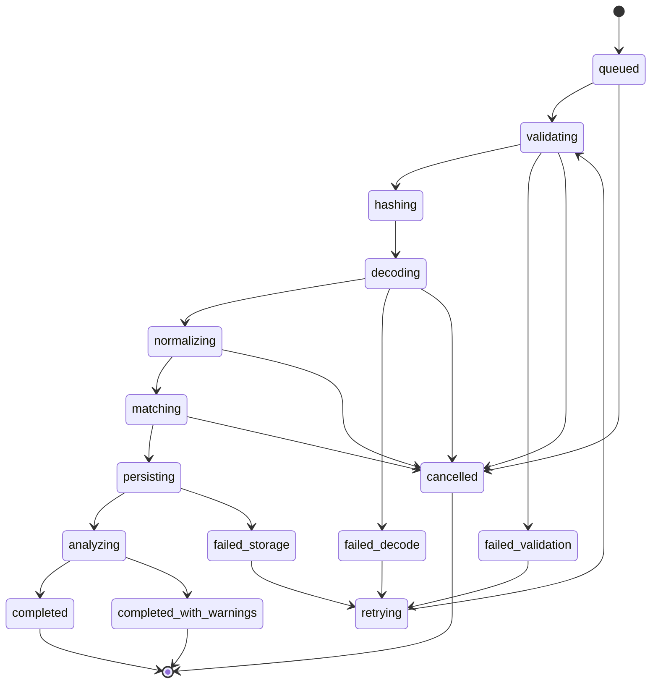
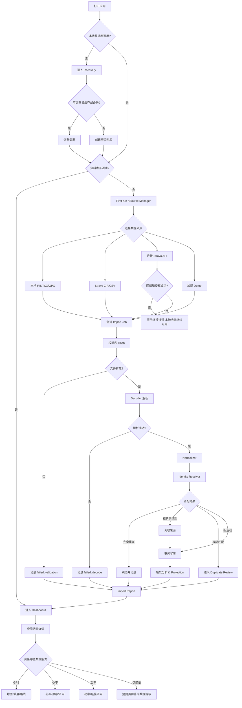
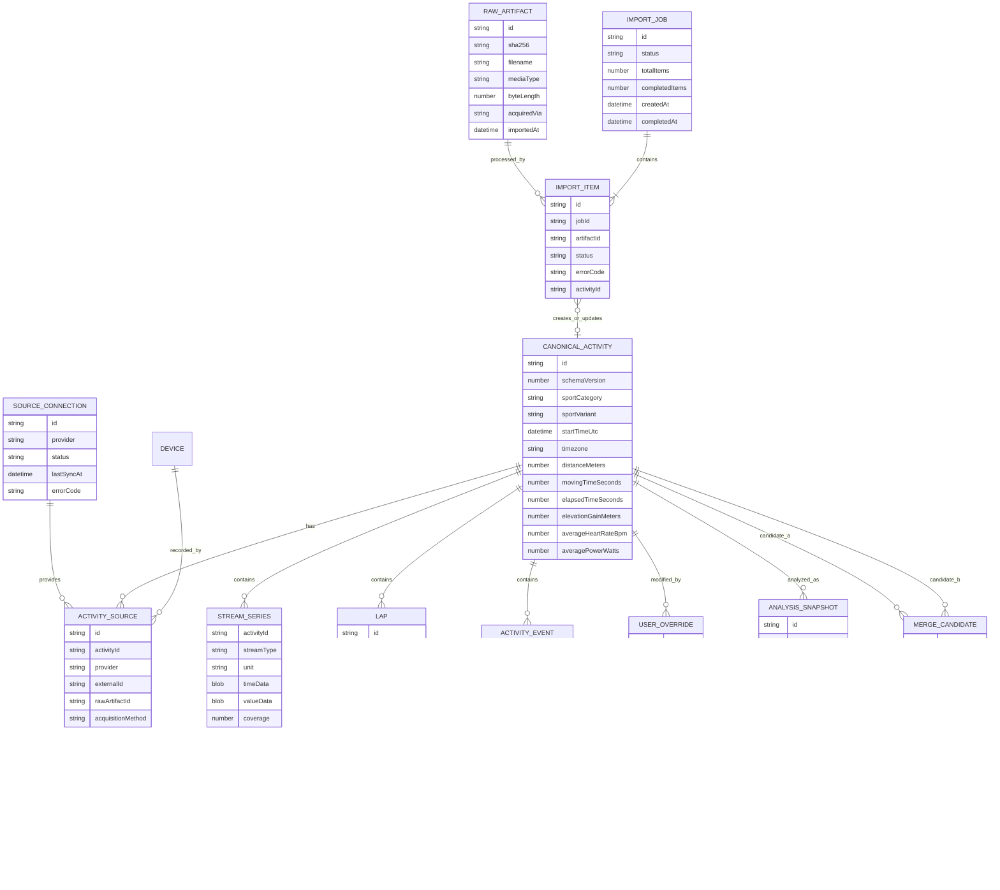
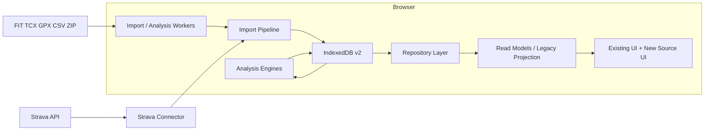

# StravaStats v2 本地优先多数据源架构迁移

## 产品需求文档 v1.0

**文档状态：** Proposed
**工程代号：** StravaStats v2
**产品名称：** StravaStats v2 — Local-First Multi-Source Sports Analytics
**当前稳定基线：** `main` 已合并 Run Plus / NSM 的 PR #1，合并提交为 `8b16ebe1a706f1713602ab5266e47000caf31a17`。
**产品形态：** 单用户、本地优先的 Web/PWA 运动数据分析工具
**目标版本：** v2.0.0
**主要终端：** 桌面浏览器优先，移动浏览器/PWA 作为辅助
**风险等级：** 需要专业工程支持的正式产品

本项目涉及运动轨迹、心率、功率、设备信息等隐私数据，还涉及数据库迁移、原始文件解析和多来源合并。它不是支付、医疗诊断或金融系统，但也不应被当作低风险页面功能处理。

本次 PRD 和开发计划遵循的核心原则是：

> 工程不是“能跑就行”，而是必须可验证、可追踪、可回滚、可恢复、可复盘。

这也是非技术背景产品负责人在 AI 时代应建立的能力边界：AI 可以加速代码产出，但需求、风险、验收和工程责任不能交给 AI 自动承担。 类似售票系统事故所暴露的认证崩溃、状态不一致、缺少监控与人工兜底，本质上都不是“少写几行代码”，而是缺少完整工程设计。

---

# 第一部分：产品需求文档

## 1. 对原始 PRD 模板的调整

原始模板更适合从零开发一个新 App，而本项目是对已有系统进行高风险渐进式迁移。因此作以下调整。

| 原始要求                      | 本 PRD 的处理                                                                         |
| ------------------------- | --------------------------------------------------------------------------------- |
| 为所有页面重新生成 HTML 原型         | 删除。现有 Dashboard、Run、Bike、Swim、Run Plus、NSM 等页面原则上保持视觉不变，只为新增的数据源管理、导入、合并和恢复流程设计原型 |
| 所有功能都设计 RESTful API       | 调整。v2.0 以浏览器本地 IndexedDB 和 JavaScript Repository 为主，不为本地 FIT 导入额外建立云后端            |
| 2–4 周完成全部开发               | 调整为多个双周 Sprint。该迁移同时涉及数据模型、存储、文件解析、页面切换和回滚，强行压缩会显著增加数据损坏风险                        |
| 开发期间同步升级所有分析算法            | 删除。v2.0 首先保证旧分析结果兼容；CTL、ATL、TSB 等算法修订放入独立 Analysis v2 阶段                          |
| 一开始接 Garmin、COROS 等全部 API | 删除。v2.0 优先支持本地文件、Strava 归档和现有 Strava API；厂商云端 Connector 放入 P2                     |
| Demo 继续作为页面特殊分支           | 调整。Demo 数据应走与真实文件相同的导入、存储、Repository 和页面流程                                        |
| 文件重复时直接跳过                 | 调整。完全相同文件可以跳过；同一次活动的不同来源需要建立来源关联和合并计划                                             |

---

# 2. 项目基本信息

## 2.1 一句话描述

一个不依赖单一运动平台、可以在本地导入 FIT、TCX、GPX 和 Strava 归档，并继续使用 StravaStats 现有高级分析与可视化能力的运动数据分析系统。

## 2.2 产品目标

1. 摆脱 Strava 订阅和 API 政策对核心功能的控制。
2. 最大化保留 StravaStats 已有的 Dashboard、Run、Bike、Swim、Run Plus、NSM 和活动详情分析能力。
3. 建立来源中立的数据模型，让 Garmin、COROS、Wahoo、Polar、Apple Health 等未来来源可以进入同一套分析流程。
4. 保护用户原始运动数据，默认不上传云端。
5. 为未来的马拉松训练诊断、PDF/HTML 报告和教练咨询服务建立可扩展的数据基础。
6. 通过版本化分析、备份恢复、日志和回滚，避免大规模架构迁移造成数据丢失和长期 Bug。

## 2.3 当前系统问题

当前系统仍然具有以下结构性耦合：

* 应用启动后加载一个 `allActivities` 数组，并把它直接传给全部主要页面。
* 当前 `package.json` 只有开发服务器和语法检查，没有正式测试命令。
* Strava Token 失效或登出会删除活动缓存、运动员资料、装备、过滤器和 HRV 数据。
* 当前 Service Worker 使用固定缓存名，并在开发环境注册，可能在多个 worktree 测试时产生旧缓存干扰。
* `run-plus.js` 同时承担数据质量、NSM、训练负荷、图表、DOM 渲染和本地存储，是迁移中的高冲突文件。

## 2.4 参考项目

### StravaStats

重点保留：

* 现有 Dashboard；
* Run/Bike/Swim 分析；
* Run Plus；
* NSM；
* 活动详情页；
* 高级活动分析；
* 交互式 Chart.js 可视化；
* PWA 和静态 Web 部署形态。

### Dreeve

重点借鉴：

* 本地文件作为默认数据入口；
* Parser Registry；
* FIT、TCX、GPX 统一输出；
* Activity、Streams、Laps 分层持久化；
* Import Log；
* 导入后的统一 Metrics Pipeline；
* 页面只读取领域数据，不理解源格式。

Dreeve 的 Parser 最终统一返回 Activity、Streams 和 Laps，这是本项目 Decoder Contract 的重要参考。

不照搬：

* Dreeve 的文件模式和 Strava API 模式是互斥的，本项目需要允许多个来源同时存在。
* 不照搬其 PHP、Symfony、Go 和静态 HTML Build 技术栈。
* 不直接复制 Dreeve 的 AGPL 代码，开发前必须完成依赖和许可证审查。

---

# 3. 目标用户与使用场景

## 3.1 核心用户画像

### 用户 A：高级耐力运动爱好者

特征：

* 使用 Garmin、COROS、Apple Watch、Wahoo 或其他设备；
* 有多年跑步、骑行、游泳历史；
* 关注训练负荷、心率、功率、配速、耐力和趋势；
* 不希望被单一平台或会员订阅锁定；
* 愿意在电脑上管理自己的原始运动文件。

核心任务：

```text
把历史和新增运动数据导入
→ 自动识别和去重
→ 查看长期趋势
→ 查看单次活动细节
→ 备份自己的全部数据
```

### 用户 B：马拉松教练或训练咨询者

特征：

* 需要分析自己或学员的训练数据；
* 希望将数据转换成诊断、建议和报告；
* 对数据质量、异常活动、训练结构和疲劳趋势敏感；
* 当前 v2.0 仍以单人资料库为主，多学员管理属于后续版本。

核心任务：

```text
导入某位运动员的数据
→ 检查数据质量
→ 分析跑量、强度、长跑、阈值和训练负荷
→ 生成可解释的分析结果
```

### 用户 C：隐私敏感的自托管用户

特征：

* 不希望把 GPS、心率和运动记录发送给陌生云服务；
* 接受手工导入或本地自动导入；
* 关注数据可迁移和长期保存。

核心任务：

```text
本地保存
→ 本地分析
→ 本地备份
→ 自主决定是否连接外部平台或 AI
```

---

# 4. 产品范围与优先级

## 4.1 P0：v2.0 必须完成

| 模块                | P0 要求                                                    |
| ----------------- | -------------------------------------------------------- |
| 稳定基线              | 保留 v1、安全标签、维护分支和一键回退能力                                   |
| 测试基础              | CI、单元测试、集成测试、E2E Smoke Test、隐私文件检查                       |
| 本地资料库             | 新建独立 IndexedDB，不原地修改旧缓存                                  |
| Canonical Model   | 来源中立的 Activity、Stream、Lap、Event、Device、SourceReference   |
| Repository        | 页面不再直接调用 Strava API                                      |
| 本地导入              | 支持 Strava `activities.csv`、Strava ZIP、FIT、TCX、GPX        |
| 导入状态              | 支持排队、校验、解析、写库、失败、取消、恢复和导入日志                              |
| 精确去重              | 相同文件 Hash、相同来源外部 ID、明确 FIT 会话标识                          |
| Legacy Projection | 新模型可以转换成现有页面期望的 Strava 风格字段                              |
| 页面兼容              | 现有 Dashboard、Run、Bike、Swim、Activities、Calendar、Map 等继续工作 |
| 活动详情              | 可以从本地资料库打开详情，不依赖 Strava Token                            |
| Run Plus / NSM    | 继续使用并通过新 Repository 获取数据                                 |
| 本地优先启动            | 没有 Strava Token 时也能进入系统                                  |
| Strava Connector  | 保留现有 Strava API，但降级为可选数据源                                |
| 备份恢复              | 导出和恢复完整资料库                                               |
| 数据保护              | Disconnect Strava 不删除本地活动                                |
| Feature Flags     | 支持 `legacy`、`shadow`、`canonical` 三种数据模式                  |
| 回滚                | Canonical 出现问题时切回 Legacy，不损坏原始数据                         |

## 4.2 P1：v2.1 或 v2.0 后续增强

| 模块          | P1 要求                                   |
| ----------- | --------------------------------------- |
| 模糊重复审查      | 时间、距离、时长接近时进入人工确认                       |
| 字段级来源       | 名称来自 Strava，Streams 来自 FIT，装备来自用户       |
| 可撤销合并       | Merge、Unmerge、Split、重新选择字段来源            |
| 自动化规则       | 按设备、地点、运动类型、日期自动设置装备、名称、通勤、Workout Type |
| 数据质量中心      | 缺失心率、功率、GPS 覆盖率、异常采样、设备错误               |
| Analysis v2 | 修复连续日历负荷、算法版本化和分析失效依赖                   |
| AI 外发授权     | 用户明确同意后才将选定摘要发送给外部 AI                   |
| 本地目录监听器     | 桌面 Companion 自动监控 FIT 文件夹               |

## 4.3 P2：暂不进入当前重构

* Garmin Connect API 自动同步；
* COROS API 或 MCP 自动同步；
* Polar AccessLink；
* Apple Health XML 和 HealthKit；
* Android Health Connect；
* 云端多设备同步；
* 多用户与多学员工作区；
* 教练 CRM；
* 在线订单、支付、报告交付；
* 医疗诊断；
* 自动训练处方；
* 原生 iOS/Android App。

---

# 5. 产品原则

## 5.1 Local-first

本地文件默认只在用户浏览器内处理，不上传至服务器。

## 5.2 Source-neutral

页面和分析模块不能判断：

```js
provider === 'garmin'
provider === 'strava'
```

它们只能判断：

```js
capabilities.hasGps
capabilities.hasHeartRate
capabilities.hasPower
capabilities.hasLaps
```

## 5.3 Non-destructive

* 原始文件不可变；
* 旧数据库不原地升级；
* 导入失败不写入半条活动；
* 合并不会删除来源记录；
* 用户修改以 Override 保存，不覆盖原始值。

## 5.4 Idempotent

同一文件重复导入一次或十次，最终只能产生一条有效活动或一条明确来源关联。

## 5.5 Versioned Analysis

解析器、标准化器和分析算法升级后，系统能判断哪些数据需要重新计算，而不是全部重建。

## 5.6 Progressive Migration

先双写、比较和 Shadow 验证，再逐页切换，不能一次性重写。

---

# 6. 核心业务对象

| 对象                | 业务含义                              |
| ----------------- | --------------------------------- |
| SourceConnection  | 一个外部连接，例如 Strava API              |
| RawArtifact       | 原始 FIT、TCX、GPX、CSV、ZIP 或 API JSON |
| ImportJob         | 一次批量导入任务                          |
| ImportItem        | 导入任务中的单个文件或活动                     |
| CanonicalActivity | 来源中立的统一活动                         |
| ActivitySource    | 一条活动与某个来源之间的关系                    |
| StreamSeries      | 心率、功率、GPS、距离、速度等时间序列              |
| Lap               | 自动圈或手动圈                           |
| Event             | 暂停、恢复、开始、结束等事件                    |
| Device            | 手表、码表、心率带、功率计等设备                  |
| UserOverride      | 用户对名称、类型、装备等的修正                   |
| MergeCandidate    | 可能属于同一次活动的两个来源记录                  |
| MergeDecision     | 合并决策及其理由                          |
| AnalysisSnapshot  | 某个版本算法的计算结果                       |
| BackupManifest    | 一次资料库备份的版本和完整性清单                  |

---

# 7. 核心状态机

## 7.1 ImportJob 状态机



## 7.2 MergeCandidate 状态

```text
unmatched
exact_match
high_confidence_match
review_required
merged
rejected
unmerged
```

规则：

* `exact_match` 可自动建立来源关联；
* `high_confidence_match` 在 P0 只生成建议，不自动合并；
* `review_required` 必须人工处理；
* 合并后仍可 `unmerged`。

## 7.3 AnalysisSnapshot 状态

```text
missing
queued
running
valid
stale
failed
```

触发 `stale` 的情况：

* 活动 Streams 更新；
* FTP、最大心率、区间设置变化；
* Parser 或 Analysis Version 变化；
* 用户修正运动类型；
* 新增历史活动影响时间线。

---

# 8. P0 功能需求详情

## 8.1 稳定基线与迁移保护

**触发条件：** v2 开发开始前。

**正常流程：**

1. 验证当前 `main` 的 Dashboard、Run、Run Plus、NSM、Bike、Swim 和活动详情。
2. 创建 Baseline Tag。
3. 创建 `maintenance/v1`。
4. 创建 `integration/v2`。
5. 导出当前旧缓存。
6. 固定 Demo 数据。
7. 建立 Feature Flag。

**后置状态：**

* 任意 v2 问题都可以回到 v1；
* 旧数据有备份；
* v1 和 v2 互不覆盖。

**异常处理：**

* 当前 `main` 验证失败：停止迁移，先修复 v1；
* 旧缓存无法导出：禁止开始 IndexedDB v2；
* Baseline Tag 已存在但提交不一致：人工核对，不覆盖旧标签。

---

## 8.2 Source Manager

**触发条件：**

* 首次启动；
* 用户打开“数据源”；
* 本地资料库为空；
* 用户希望增加来源。

**正常流程：**

1. 显示可用来源：

   * 本地文件；
   * Strava 归档；
   * Strava API；
   * Demo。
2. 显示每个来源状态：

   * 未配置；
   * 已连接；
   * 同步中；
   * 错误；
   * 已断开。
3. 用户选择导入或连接。
4. 数据进入统一 Import Pipeline。

**后置状态：**

* 本地资料库增加活动；
* Source Connection 或 Import Log 可查看；
* 用户可以断开 Strava，但不删除活动。

**异常处理：**

* Strava Token 失效：Source 标记为“需要重新授权”，本地活动仍可查看；
* 网络断开：本地数据正常使用；
* 没有浏览器存储权限：显示阻断错误和解决办法。

---

## 8.3 本地文件导入

**支持格式：**

```text
.fit
.tcx
.gpx
.csv
.zip
```

**正常流程：**

1. 用户拖拽或选择文件；
2. 前端校验类型和大小；
3. Worker 计算 SHA-256；
4. Decoder Registry 选择解析器；
5. 生成 `ImportedActivityBundle`；
6. 标准化单位、时间和运动类型；
7. 执行精确去重；
8. 事务写入；
9. 触发分析；
10. 显示 Import Report。

**后置状态：**

```text
success
skipped_exact_duplicate
completed_with_warnings
failed
review_required
```

**异常流程：**

| 异常        | 处理                            |
| --------- | ----------------------------- |
| 不支持格式     | 不进入导入，显示 `UNSUPPORTED_FORMAT` |
| FIT 损坏    | 记录失败，不影响同批其他文件                |
| XML 非法    | 安全终止，不解析外部实体                  |
| ZIP 文件过多  | 停止解压，显示安全风险                   |
| 浏览器空间不足   | 当前事务回滚，提示导出或清理                |
| Worker 崩溃 | Import Job 标记失败，可重试           |
| 页面关闭      | 已提交的数据保留，未完成 Item 可恢复或重试      |
| 用户取消      | 停止未完成 Item，不删除已成功 Item        |

---

## 8.4 Canonical Store 与 Repository

**正常流程：**

```text
Connector
→ RawArtifact
→ Decoder
→ Normalizer
→ Identity Resolver
→ Canonical Store
→ Repository
→ Projection
→ 页面
```

**要求：**

* 页面不读取原始文件；
* 页面不访问第三方 API；
* 页面不读取 IndexedDB 具体 Store；
* 页面只调用 Repository；
* 新活动 ID 为字符串；
* Streams、Laps、Events 与摘要分开存储；
* 打开详情时才加载逐点 Streams。

---

## 8.5 精确去重

P0 自动识别条件：

1. 相同来源 + 相同 external ID；
2. 相同原始文件 SHA-256；
3. 相同 FIT session/file identity；
4. 已明确建立的 Source Reference。

P0 不自动合并：

* 开始时间接近但不完全一致；
* 距离相近；
* 文件名相似；
* 路线近似。

这些只生成 `review_required`。

---

## 8.6 Legacy Projection 与页面兼容

Canonical Activity 暂时转换为现有页面期望的字段：

```js
{
  id,
  type,
  sport_type,
  name,
  distance,
  moving_time,
  elapsed_time,
  start_date,
  start_date_local,
  average_heartrate,
  average_watts,
  average_cadence,
  gear_id,
  map: {
    summary_polyline
  }
}
```

目标不是永久保留 Strava 命名，而是避免 v2 同时重写全部页面。

---

## 8.7 本地优先启动

新的启动流程：

```text
打开应用
→ 初始化本地资料库
→ 检查是否有活动
```

有活动：

```text
直接进入 Dashboard
```

无活动：

```text
进入 First-run / Source Manager
```

Strava 登录不再是进入系统的必要条件。

---

## 8.8 备份与恢复

备份包至少包含：

```text
manifest.json
activities.jsonl
sources.jsonl
streams/
laps.jsonl
events.jsonl
devices.jsonl
overrides.jsonl
analysis/
settings.json
raw/
```

要求：

* 备份包含 Schema Version；
* 每个文件有 Hash；
* 恢复前先校验；
* 版本不兼容时不得强制恢复；
* 恢复失败不覆盖当前资料库；
* 支持恢复到新的浏览器环境。

---

# 9. 非功能性需求

## 9.1 稳定性

| 指标        | 要求                     |
| --------- | ---------------------- |
| 数据迁移丢失    | 0 条                    |
| 同文件重复导入   | 不得产生第二条活动              |
| 单文件失败     | 不影响同批其他文件              |
| 页面未捕获异常   | 0                      |
| 数据库迁移     | 幂等，可重复运行               |
| 合并操作      | 可撤销                    |
| Strava 断开 | 不删除本地资料库               |
| 回滚        | Feature Flag 切回 Legacy |

## 9.2 性能预算

以一台近五年的普通桌面电脑为参考环境。

| 场景                 | 目标                     |
| ------------------ | ---------------------- |
| App Shell 首次可交互    | 桌面网络环境下不超过 2.5 秒       |
| 5,000 条活动摘要查询      | 不超过 1 秒                |
| Activities 首屏渲染    | 不超过 1.5 秒              |
| 单个普通 FIT 导入        | 持续显示进度，主线程不得明显冻结       |
| 1,000 个文件批量导入      | 可取消、可恢复、逐文件提交          |
| 200,000 个 Stream 点 | 必须降采样，不直接全部绘制          |
| 页面主线程长任务           | 单次尽量不超过 100ms          |
| IndexedDB 读取详情     | 按需加载，不能启动时读取全部 Streams |

## 9.3 安全与隐私

* 默认不将原始文件发送服务器；
* 不在日志中记录 GPS、完整心率流、文件内容；
* 不在外部埋点中记录文件名、运动轨迹、用户姓名、设备序列号；
* XML 禁止外部实体；
* ZIP 限制文件数量、压缩比和总解压大小；
* 导入文本必须 HTML 转义；
* OAuth Secret 不进入前端；
* Local data、Private fixtures 加入 `.gitignore`；
* 外部 AI 调用必须单独授权；
* P0 不宣称提供医疗建议。

## 9.4 兼容性

正式支持：

```text
Chrome 最新两个大版本
Safari 最新两个大版本
Firefox 最新两个大版本
macOS Desktop
Windows Desktop
iOS Safari/PWA 基础查看
```

限制：

* 大规模 ZIP/FIT 批量导入以桌面端为主要场景；
* 移动端可能因内存和浏览器存储限制不支持大批量导入；
* P0 不承诺后台持续导入。

## 9.5 可观察性

默认本地记录：

```text
Import Job 状态
Import Item 状态
Decoder 错误
数据库错误
Analysis 错误
Migration 版本
最近页面错误
```

对外诊断包默认不包含隐私数据。

## 9.6 埋点

默认不上传活动数据。可选匿名产品事件：

```text
source_manager_opened
import_started
import_completed
import_failed
duplicate_detected
merge_review_opened
backup_created
restore_completed
repository_fallback_used
```

禁止属性：

```text
经纬度
活动名称
真实文件名
Strava ID
心率
功率
用户姓名
```

---

# 10. 用户故事与验收标准

## Epic A：本地导入

### 故事 A1

作为运动用户，我希望一次选择多份 FIT 文件，以便快速建立自己的本地资料库。

**Given** 用户处于 Source Manager
**When** 用户选择 100 份有效 FIT 文件
**Then**

* 每份文件独立显示状态；
* 页面持续显示进度；
* 导入过程不阻塞主要 UI；
* 成功文件写入资料库；
* 失败文件显示原因；
* 同批成功结果不会因一个失败文件回滚。

### 故事 A2

作为运动用户，我希望重复导入相同文件时不会产生重复活动。

**Given** 某 FIT 已成功导入
**When** 用户再次导入同一文件
**Then**

* 系统识别相同 SHA-256；
* 不新建活动；
* Import Log 记录 `skipped_exact_duplicate`；
* 原活动数据不被修改。

---

## Epic B：Strava 归档

### 故事 B1

作为不订阅 Strava 的用户，我希望导入 Strava 全量归档，以便继续使用原有分析页面。

**Given** 用户拥有有效 Strava ZIP
**When** 用户导入 ZIP
**Then**

* 系统识别 `activities.csv`；
* 导入活动摘要；
* 关联 ZIP 内原始活动文件；
* 生成导入报告；
* Dashboard、Activities 和 Calendar 可显示结果。

### 故事 B2

作为用户，我希望只有 CSV 的活动也能显示，而不是因缺少 Streams 报错。

**Given** 某活动只有摘要
**When** 用户打开活动详情
**Then**

* 显示摘要数据；
* 不显示无数据图表；
* 提示“导入原始 FIT/TCX 可获得详细分析”；
* 页面不出现未捕获异常。

---

## Epic C：本地优先启动

### 故事 C1

作为本地用户，我希望没有 Strava Token 时仍能打开已有资料库。

**Given** 本地资料库有活动，Strava Token 不存在
**When** 用户打开应用
**Then**

* 应用直接进入 Dashboard；
* 不强制跳转登录；
* 本地活动可以正常查看；
* Strava Source 显示“未连接”。

### 故事 C2

作为用户，我希望断开 Strava 后仍保留已经导入的活动。

**Given** 用户连接了 Strava 并已有本地活动
**When** 用户执行“断开 Strava”
**Then**

* Token 被删除；
* 自动同步停止；
* 本地 Activity、Streams、Laps 不删除；
* 系统询问是否另行删除 Strava 专属元数据。

---

## Epic D：页面兼容

### 故事 D1

作为现有用户，我希望 v2 升级后原 Dashboard 统计不发生无解释变化。

**Given** 同一份 Strava 活动数据
**When** 系统分别通过 Legacy 与 Canonical Projection 渲染
**Then**

* 活动数量一致；
* 总距离和总时间一致；
* 月度、年度分组一致；
* Gear 关联一致；
* 任何差异进入 Parity Report。

### 故事 D2

作为 Run Plus / NSM 用户，我希望迁移后原有标签和设置继续保留。

**Given** 用户有 NSM 设置和活动标签
**When** Repository 切换为 Canonical
**Then**

* 设置和标签仍可读取；
* NSM 页面可打开；
* 核心统计与 Legacy 版本一致；
* 切回 Legacy 时仍可使用。

---

## Epic E：备份恢复

### 故事 E1

作为用户，我希望导出全部资料库，以便避免浏览器数据丢失。

**Given** 本地资料库有活动
**When** 用户执行备份
**Then**

* 生成带版本和 Hash 的备份包；
* 包含活动、Streams、Laps、设置和来源关系；
* 显示备份完成时间和文件大小。

### 故事 E2

作为用户，我希望在新浏览器恢复备份。

**Given** 当前资料库为空，用户有兼容备份
**When** 用户执行恢复
**Then**

* 系统先校验 Manifest 和 Hash；
* 显示将要恢复的活动数量；
* 恢复失败不破坏当前资料库；
* 恢复成功后主要页面可正常打开。

---

## Epic F：重复活动审查

### 故事 F1

作为用户，我希望系统自动识别完全相同的活动来源。

**Given** 一条 Strava 活动和一份具有相同明确标识的 FIT
**When** FIT 被导入
**Then**

* 系统建立新的 ActivitySource；
* 不新建第二个 CanonicalActivity；
* Streams 可以使用更完整来源；
* 来源关系可以查看。

### 故事 F2

作为用户，我希望系统不要把两个相似训练自动合并。

**Given** 两次训练开始时间相近，距离和时长相似，但没有确定标识
**When** Identity Resolver 运行
**Then**

* 状态为 `review_required`；
* 两条活动均保留；
* 用户可以查看差异；
* 未确认前不执行合并。

---

# 11. 页面清单

## 11.1 新增或重点改造页面

| 页面               | 用途                           |
| ---------------- | ---------------------------- |
| First-run        | 本地资料库为空时选择导入、Demo 或连接 Strava |
| Source Manager   | 管理本地文件、Strava 归档和 Strava API |
| Import Dialog    | 拖拽和选择文件                      |
| Import Progress  | 显示逐文件进度、取消和错误                |
| Import Report    | 显示成功、跳过、失败和待确认               |
| Duplicate Review | 审查可能重复活动                     |
| Merge Detail     | 比较字段来源并确认合并                  |
| Storage & Backup | 存储空间、备份、恢复、清理                |
| Diagnostics      | 导出诊断信息和查看最近错误                |
| Recovery         | 数据库异常或版本不兼容时的恢复入口            |

## 11.2 保留的现有页面

```text
Dashboard
Run
Run Plus
NSM
Bike
Swim
Activities
Calendar
Map
Gear
Planner
Wrapped
Activity Detail
Settings
```

P0 原则：

* 保留现有视觉；
* 只替换数据访问路径；
* 无对应数据能力时隐藏模块；
* 不在此次迁移中进行大规模 UI 重设计。

---

# 12. 核心用户流程



---

# 13. 页面交互说明

## 13.1 First-run

**进入条件：**

* 本地资料库为空；
* 首次使用；
* 用户选择重置资料库后。

**可交互元素：**

* 导入本地文件；
* 导入 Strava 归档；
* 连接 Strava；
* 加载 Demo；
* 恢复备份；
* 查看隐私说明。

**状态：**

| 状态     | 表现                 |
| ------ | ------------------ |
| 默认     | 四个主要入口卡片           |
| 存储不可用  | 阻断提示               |
| 检测到旧缓存 | 显示“恢复旧版数据”         |
| 网络离线   | Strava 入口禁用，本地入口正常 |
| 恢复中    | 进度条和取消按钮           |

---

## 13.2 Source Manager

**进入条件：**

* 点击顶部“Sources/Data”；
* First-run 完成后；
* 来源发生错误。

**卡片字段：**

```text
来源名称
连接状态
最后成功导入时间
活动数量
错误状态
同步/导入按钮
断开按钮
删除来源数据按钮
```

“断开”与“删除数据”必须是两个不同操作。

---

## 13.3 Import Dialog

**交互：**

* 点击选择；
* 拖拽文件；
* 多选；
* 删除待上传文件；
* 开始导入；
* 取消。

**文件预检查：**

```text
扩展名
文件头
大小
数量
重复文件 Hash
```

**错误文案示例：**

* “该文件格式暂不支持。”
* “文件可能已损坏，未写入资料库。”
* “浏览器可用存储空间不足。”
* “该文件与已导入文件完全相同，已跳过。”
* “发现可能属于同一次训练的记录，需要人工确认。”

---

## 13.4 Import Progress

每个 Item 显示：

```text
文件名脱敏显示
当前阶段
进度
状态
警告
取消/重试
```

批量状态：

```text
总数
成功
跳过
失败
待确认
预计占用空间
```

不得只显示一个不可解释的无限 Loading。

---

## 13.5 Import Report

筛选：

```text
All
Success
Skipped
Warnings
Failed
Review required
```

每条记录可：

* 打开活动；
* 查看错误；
* 重试；
* 查看匹配候选；
* 从 Import Log 删除记录，但不删除活动；
* 导出诊断。

---

## 13.6 Duplicate Review

左右对比：

```text
开始时间
运动类型
距离
时长
设备
来源
轨迹摘要
心率覆盖率
功率覆盖率
Laps 数量
```

操作：

```text
确认同一活动
保持为两条活动
稍后处理
```

P0 不提供复杂字段级选择；P1 增加。

---

## 13.7 Storage & Backup

显示：

```text
活动数量
原始文件大小
Streams 大小
分析缓存大小
浏览器剩余空间
最近备份时间
数据库版本
```

操作：

```text
创建备份
恢复备份
删除分析缓存
删除原始文件但保留标准化数据
删除全部资料库
```

所有破坏性操作必须二次确认。

---

# 14. UI 设计规范

## 14.1 设计策略

v2.0 不重做现有视觉系统。新增页面应与当前 StravaStats 保持一致，避免视觉改造和数据架构改造同时发生。

## 14.2 基础 Token

```css
- -font-sans: system-ui, -apple-system, BlinkMacSystemFont, "Segoe UI", sans-serif;

- -space-1: 4px;
- -space-2: 8px;
- -space-3: 12px;
- -space-4: 16px;
- -space-5: 24px;
- -space-6: 32px;
- -space-7: 48px;

- -radius-sm: 6px;
- -radius-md: 10px;
- -radius-lg: 16px;

- -color-info: #1d4ed8;
- -color-success: #15803d;
- -color-warning: #b45309;
- -color-danger: #b91c1c;

- -surface-1: #ffffff;
- -surface-2: #f8fafc;
- -border-default: #e2e8f0;
- -text-primary: #0f172a;
- -text-secondary: #475569;
```

Primary Brand Color 沿用当前项目，不在本次迁移中修改。

## 14.3 组件清单

| 组件           | 变体                                 | 状态                                    |
| ------------ | ---------------------------------- | ------------------------------------- |
| Button       | primary、secondary、ghost、danger     | default、hover、disabled、loading        |
| Source Card  | local、archive、API、demo             | connected、disconnected、error、syncing  |
| Dropzone     | normal、compact                     | idle、dragging、invalid、disabled        |
| Import Item  | compact、expanded                   | queued、running、success、warning、failed |
| Status Badge | info、success、warning、error         | 静态                                    |
| Progress Bar | batch、single-item                  | determinate、indeterminate             |
| Modal        | standard、destructive               | open、closing                          |
| Diff Table   | two-column、three-column            | unchanged、conflict、selected           |
| Empty State  | first-run、no-results、no-capability | 默认                                    |
| Error Panel  | inline、page-level                  | retryable、blocking                    |
| Toast        | success、warning、error              | auto-dismiss、persistent               |

## 14.4 原型交付边界

不要求为所有现有页面重新生成独立 HTML。

正式原型只覆盖：

```text
First-run
Source Manager
Import Dialog/Progress
Import Report
Duplicate Review
Storage & Backup
```

原型应作为独立 UI PR，不与数据库或 Decoder PR 混合。

---

# 15. 数据模型



---

# 16. IndexedDB Object Stores

```text
rawArtifacts
importJobs
importItems
activities
activitySources
streamSeries
laps
events
devices
userOverrides
analysisSnapshots
timelineSnapshots
mergeCandidates
mergeDecisions
sourceConnections
settings
migrations
```

关键索引：

```text
activities.startTimeUtc
activities.sportCategory
activitySources.[provider, externalId]
rawArtifacts.sha256
importJobs.createdAt
analysisSnapshots.[activityId, analysisType, inputHash]
mergeCandidates.status
```

---

# 17. 内部接口设计

本项目的主要接口不是 REST API，而是 JavaScript Contract。

## 17.1 ActivityRepository

```js
class ActivityRepository {
  async listSummaries(query) {}
  async getSummary(activityId) {}
  async getDetail(activityId) {}
  async getActivityBundle(activityId) {}
  async count(query) {}
}
```

## 17.2 StreamRepository

```js
class StreamRepository {
  async getStreams(activityId, requestedTypes) {}
  async hasStream(activityId, streamType) {}
}
```

## 17.3 ImportService

```js
class ImportService {
  async createJob(artifacts, options) {}
  async cancelJob(jobId) {}
  async retryItem(itemId) {}
  async getJob(jobId) {}
}
```

## 17.4 SourceConnector

```js
class SourceConnector {
  async connect() {}
  async disconnect() {}
  async fetchChanges(cursor) {}
  async getStatus() {}
}
```

## 17.5 AnalysisRepository

```js
class AnalysisRepository {
  async getValidSnapshot(activityId, analysisType, settings) {}
  async saveSnapshot(snapshot) {}
  async invalidate(activityId, reason) {}
}
```

## 17.6 BackupService

```js
class BackupService {
  async exportLibrary(options) {}
  async validateBackup(file) {}
  async restoreBackup(file, strategy) {}
}
```

---

# 18. 错误码

```text
UNSUPPORTED_FORMAT
FILE_EMPTY
FILE_CORRUPTED
FILE_TOO_LARGE
TOO_MANY_FILES
ZIP_BOMB_RISK
ZIP_PATH_TRAVERSAL
DECODER_FAILED
UNKNOWN_SPORT_TYPE
STORAGE_UNAVAILABLE
STORAGE_QUOTA_EXCEEDED
DATABASE_MIGRATION_FAILED
EXACT_DUPLICATE
MERGE_REVIEW_REQUIRED
IMPORT_CANCELLED
WORKER_CRASHED
BACKUP_HASH_MISMATCH
BACKUP_SCHEMA_UNSUPPORTED
STRAVA_AUTH_REQUIRED
STRAVA_RATE_LIMITED
STRAVA_NETWORK_ERROR
ANALYSIS_FAILED
PROJECTION_FAILED
```

统一错误响应：

```js
{
  code: "DECODER_FAILED",
  message: "The FIT file could not be decoded.",
  retryable: true,
  details: {
    itemId: "import_item_123"
  }
}
```

---

# 19. 技术架构

## 19.1 技术栈

| 层                 | 选择                                     |
| ----------------- | -------------------------------------- |
| 前端                | 保留 Vanilla JavaScript + ES Modules     |
| 页面                | 保留现有 HTML、CSS、Chart.js                 |
| 数据库               | IndexedDB，新数据库 `strava-stats-v2`       |
| 文件解析              | Web Worker                             |
| FIT               | 许可证确认后的 JavaScript FIT SDK             |
| TCX/GPX           | 安全 XML Parser                          |
| ZIP               | 浏览器端解压库，带安全限制                          |
| Schema Validation | Zod 或等价 Runtime Validator              |
| 单元测试              | `node:test` 或 Vitest                   |
| IndexedDB 测试      | `fake-indexeddb`                       |
| E2E               | Playwright                             |
| CI                | GitHub Actions                         |
| 部署                | 继续使用 Vercel Static + Serverless API    |
| API               | 仅保留 Strava Connector 所需 Serverless API |

## 19.2 明确不做

* 不在本次重构中迁移 React、Vue 或 Flutter；
* 不同时进行全量 TypeScript 重写；
* 不引入新的云数据库；
* 不把本地 FIT 上传到 Vercel；
* 不让页面直接读取 IndexedDB；
* 不让 Decoder 直接生成 Chart.js 数据。

## 19.3 架构图



---

# 20. 产品成功标准

## v2.0 发布前必须达到

1. 无 Strava Token 时应用可正常启动；
2. 本地 CSV/FIT/TCX/GPX 可导入；
3. 同一文件重复导入不重复；
4. Strava 断开不删除本地活动；
5. 旧缓存可导出和恢复；
6. 新旧活动数量一致；
7. 主要汇总页面通过 Parity Test；
8. 活动详情可以读取本地 Streams；
9. Run Plus / NSM 可读取 Canonical Repository；
10. 完整资料库可备份恢复；
11. Feature Flag 可以切回 Legacy；
12. 没有未处理的数据库迁移错误；
13. 没有真实运动数据进入 Git；
14. 没有通过埋点上传 GPS 或健康数据；
15. 所有受保护分支必须通过 CI。
